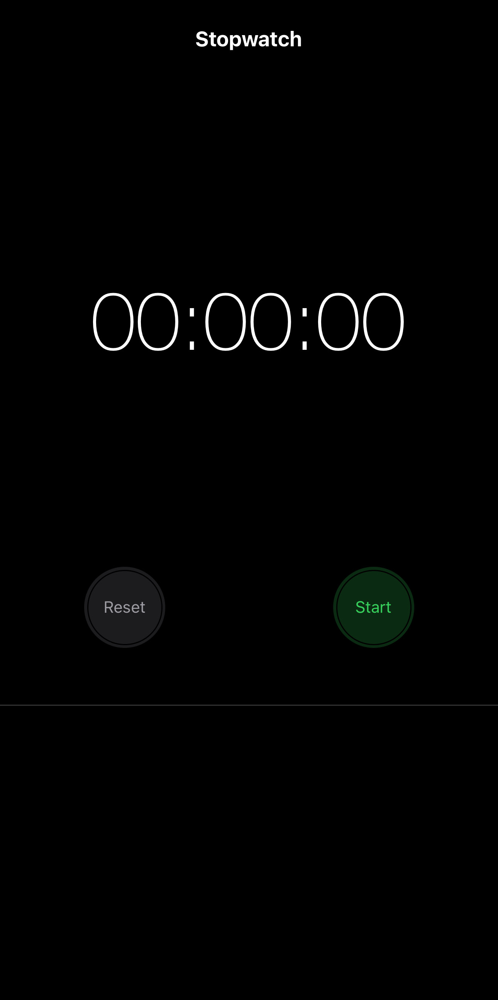
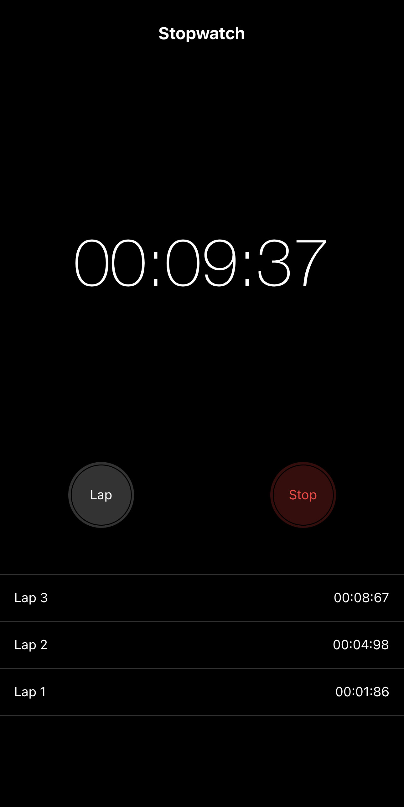

## React Native Stopwatch App

### Overview

A simple React Native mobile app that functions as a stopwatch. The app includes a control panel for starting, stopping, resetting, and capturing lap times.

### Key Features

- Stopwatch Functionality: Start, stop, and reset the stopwatch.
- Lap Times: Capture lap times while the stopwatch is running.
- Clean User Interface: A user-friendly interface for a seamless experience.

### Technologies Used

- React Native
- Expo

### Prerequisites

1. Node.js installed on your machine.
2. Expo CLI installed globally.
3. Expo Go app on your mobile device or an emulator.

### How to Run

1. Clone the repository.
2. Install dependencies using `npm install`.
3. Run the app using `npm start` or `expo start`.

### Running on a Mobile Device

#### For iOS:

1. Download and install the Expo Go app from the [App Store](https://apps.apple.com/app/apple-store/id982107779).
2. Open Expo Go and scan the QR code displayed in the terminal after running `npm start` or `expo start`.

#### For Android:

1. Download and install the Expo Go app from [Google Play](https://play.google.com/store/apps/details?id=host.exp.exponent&pcampaignid=web_share).
2. Open Expo Go and scan the QR code displayed in the terminal after running `npm start` or `expo start`.

## Screenshots of the Mobile App

**Main Screen**

- This is the main screen that allows you to start your stopwatch.
  

**Lap Screen**

- In this screenshot, you can see that the stopwatch has been started, and there are already a few recorded laps.
  
